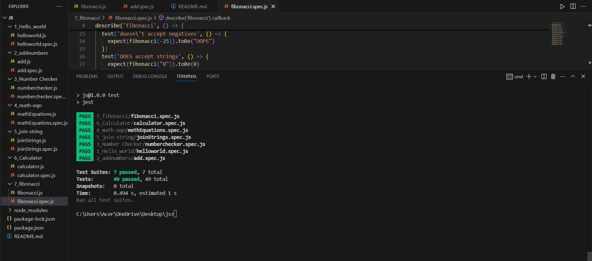

# JavaScript Practice with Jest

This repository contains 7 beginner-level JavaScript practice tasks, each accompanied by test files using **Jest**, a popular JavaScript testing framework. These practices aim to build confidence in writing testable JavaScript code.

## Output 

